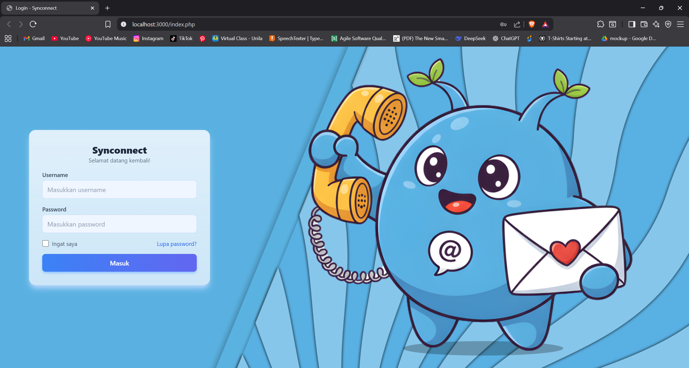
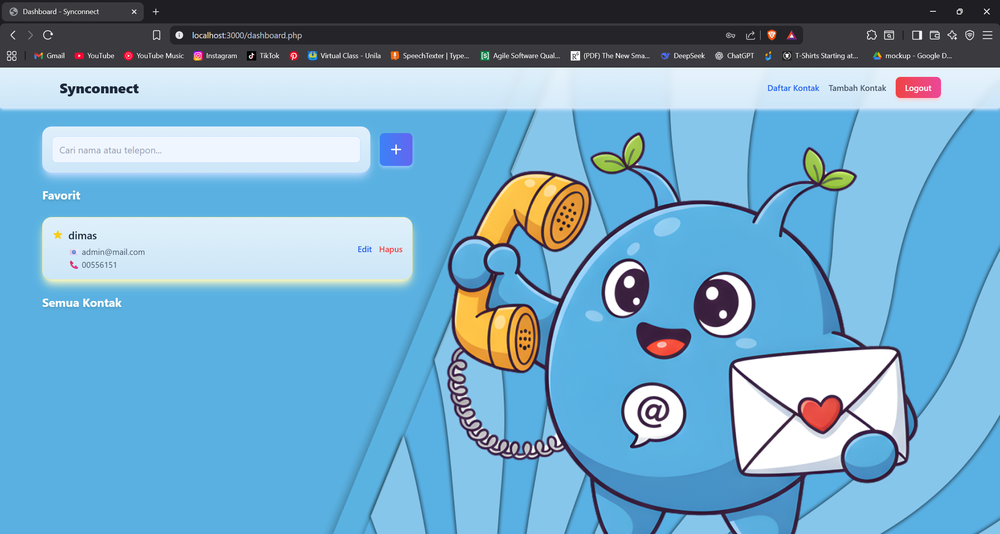
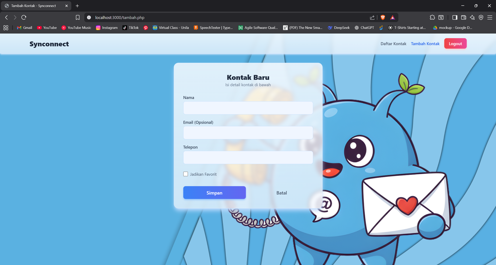
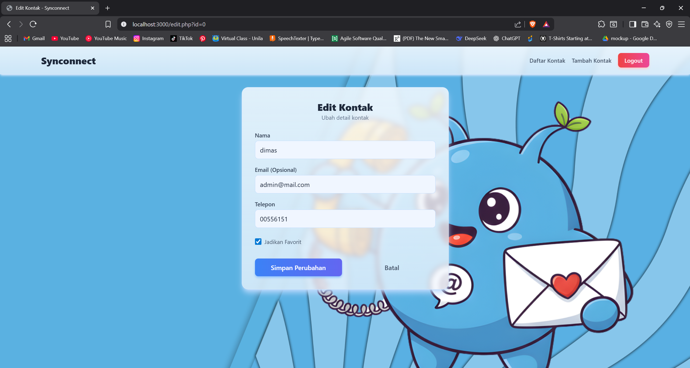

# Tugas Akhir PPW 4: Synconnect (Sistem Manajemen Kontak)

Synconnect adalah aplikasi web sederhana untuk manajemen kontak yang dibangun sebagai Tugas Akhir mata kuliah Praktikum Pemrograman Web (PPW). Aplikasi ini memungkinkan pengguna untuk melakukan operasi CRUD (Create, Read, Update, Delete) pada daftar kontak pribadi.

Fitur unik dari aplikasi ini adalah **tidak menggunakan database** eksternal. Semua data kontak disimpan sementara dalam **PHP Session** (`$_SESSION["kontak"]`). Ini berarti data kontak akan tersimpan selama pengguna masih dalam sesi login yang sama, namun akan hilang saat sesi berakhir (misalnya, saat browser ditutup atau setelah *logout*).

## Fitur

* **Autentikasi:** Halaman login sederhana untuk melindungi akses ke daftar kontak.
* **Dashboard:** Menampilkan semua kontak yang tersimpan, dipisahkan menjadi bagian "Favorit" dan "Semua Kontak".
* **Tambah Kontak:** Form untuk menambahkan kontak baru, mencakup Nama, Email (opsional), dan Telepon.
* **Edit Kontak:** Mengubah detail kontak yang sudah ada.
* **Hapus Kontak:** Menghapus kontak dari daftar.
* **Kontak Favorit:** Kemampuan untuk menandai atau menghapus tanda favorit pada kontak.
* **Pencarian:** Fitur pencarian *real-time* di dashboard untuk menyaring kontak berdasarkan nama atau nomor telepon (BELUM BISA DIGUNAKAN KARNA BELUM MENGGUNAKAN JS)
* **Logout:** Mengakhiri sesi pengguna dan menghapus semua data kontak.
* **Desain Responsif:** Dibuat menggunakan Tailwind CSS.

## Tangkapan Layar (Screenshots)

Berikut adalah beberapa tangkapan layar dari aplikasi yang ada di dalam folder `ss/`.

**1. Halaman Login**

**2. Dashboard (Daftar Kontak)**

**3. Halaman Tambah Kontak**

**4. Halaman Edit Kontak**

## Teknologi yang Digunakan

* **Backend:** PHP (Native)
* **Frontend:** HTML
* **Styling:** Tailwind CSS
* **Penyimpanan Data:** PHP Session (`$_SESSION`)

### Kredensial Login

Gunakan kredensial *hardcoded* berikut (dari `index.php`) untuk masuk:

* **Username:** `dimas`
* **Password:** `dimas`
